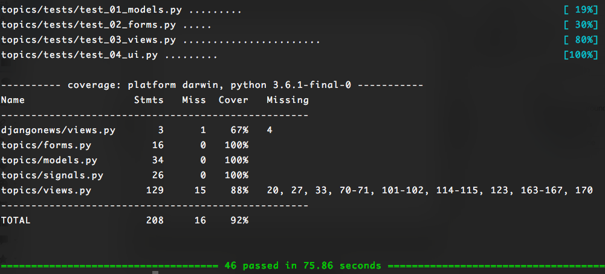
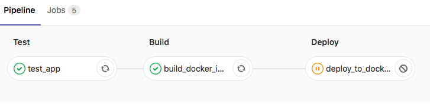

## Introduction
This is a mini project to learn the Django Framework (2.0), Docker/docker-compose, Pytest/Selenium and Gitlab CI ( Continuous Integration)

## Description of the Django App
- The User signs up/in using Facebook
- User can submit a new Topic
- User can upvote a Topic
- User can comment on a Topic
- User can sort Topics by 'Most Recent' & 'Most Rated'
- User can see number of comments by Topic
- User can click on 'more' to see the next 50 Topics

## Technical description of the project

### Architecture

Client ------------- (4433) NGINX <-------> (8000) Django App (GUNICORN) <-----> (5432) PostgreSQL

The Project is set up using docker-compose and divided into three components:

1. The Web Server    (NGINX): listening on port 4433 (HTTPS) and reverse proxying to the App server (also on HTTPS)
2. The App Server (GUNICORN): is the Django App listening on port 8000 and configured to accept HTTPS
3. The DB Server(PostgreSQL): Database all managed by Django's ORM and pyscopg2 (python adapter for postgres)

### Tests

The tests are performed using pytest ( coupled with selenium for UI ), and are grouped in the djangonews/topics/tests folder.

There are 2 types of tests:
- Unit Tests: Tests on individual models, forms
- Integration Tests: Tests on Views and UI (Selenium)

The test coverage is of about 92%

### Continuous Integration

Gitlab CI was used for continuous integration.

The file gitlab-ci.yml specifies 3 stages: test, build and deploy.

